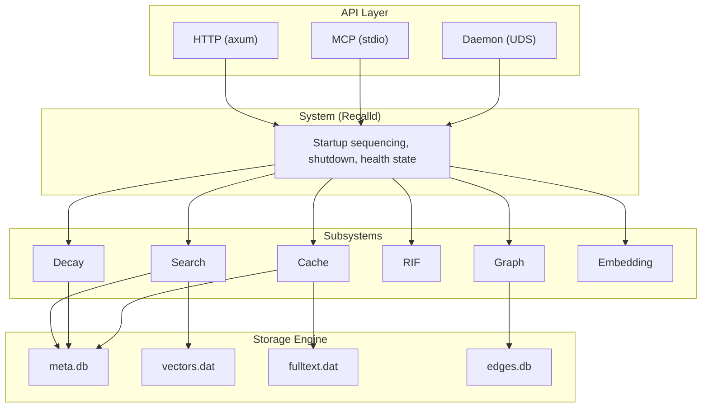
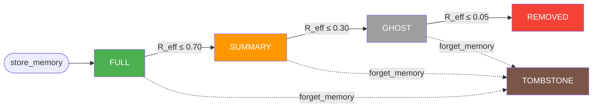

# recalld Architecture


## 1. Overview

recalld is an AI memory system written in Rust. It stores observations, facts, and context as "memories" that decay over time following the FSRS v4.5 spaced repetition model, unless reinforced by retrieval.

### Design goals

- **Spaced-repetition decay**: memories weaken over time and are strengthened by retrieval, following the spacing effect and forgetting curve.
- **Phase transitions**: memories transition through phases (Full -> Summary -> Ghost -> Removed), dropping data at each step. Explicit deletion produces a Tombstone (content stripped, but graph node and edges preserved for spreading activation relay).
- **Associative recall**: a graph of typed relationships enables spreading activation, so retrieving one memory can surface related ones.
- **Retrieval-induced forgetting (RIF)**: retrieving a memory suppresses competing neighbors, matching the empirical RIF effect from human cognition.
- **Pluggable embeddings**: works with OpenAI, Ollama (local), or pre-computed vectors.
- **Single-process, single-binary**: no external database dependencies. All storage uses files in a single data directory.

---

## 2. System Architecture

### Layer diagram



### Startup sequence (system.rs)

The `Recalld::new()` constructor executes an ordered 10-step startup:

1. **Open storage** -- acquires exclusive file lock, opens all four storage backends.
2. **Scan all records** -- single full-table scan of meta.db, reused by steps 2b-6c.
3. **Build relationship graph** -- inserts nodes from scanned records, loads edges from edges.db.
4. **Initialize cache** -- creates `CacheManager` with moka configuration.
5. **Create embedding provider** -- selects OpenAI, Ollama, or Passthrough based on config.
6. **Create RIF engine** -- initializes with configured thresholds and parameters.
7. **Create indexes** -- `FlatVectorIndex`, `FtsIndex` (SQLite FTS5), `EntityIndex`.
8. **Create QueryEngine** -- wires all subsystems via dependency-injection trait objects.
9. **Start decay sweep** -- spawns background tokio task for periodic decay sweeps.
10. **Ensure default namespace** -- creates the "default" namespace if it does not exist.

Shutdown is the reverse: signal background tasks, drain in-flight requests (5s timeout), join the sweep task, flush and sync storage, persist phase index.

---

## 3. Storage Engine

### Core storage files

All data lives in a single directory (default: `~/.recalld/data/`). An exclusive file lock (`recalld.lock`) prevents multi-process access. There are four primary data files (meta.db, vectors.dat, fulltext.dat, edges.db) plus the FTS5 index (fts.db) and the lock file.

```
~/.recalld/data/
  recalld.lock        # flock() exclusive lock
  meta.db             # redb B+tree -- memory records + secondary indexes
  fulltext.dat            # append-only CRC32 log -- full_text payloads
  edges.db            # redb B+tree -- graph edge persistence
  ns_default.dat      # mmap'd vector file for "default" namespace
  ns_work.dat         # mmap'd vector file for "work" namespace (example)
  fts.db              # SQLite FTS5 full-text search index
```

#### meta.db (redb)

The primary metadata store. Contains:

| Table | Key | Value | Purpose |
|-------|-----|-------|---------|
| `memories` | UUID v7 bytes `[u8; 16]` | `DiskRecord` (version-prefixed binary) | Primary record storage |
| `namespaces` | `u32` (NamespaceId) | JSON-encoded `NamespaceConfig` | Namespace configurations |
| `namespace_counter` | `"max_id"` | `u32` | Monotonic ID assignment |
| `indexes` | index name string | Serialized RoaringBitmap bytes | Phase bitmap persistence |
| `tag_index` | Lowercased tag string | UUID bytes (multimap) | Tag inverted index |
| `namespace_index` | `u32` (NamespaceId) | UUID bytes (multimap) | Namespace membership index |

The `PhaseIndex` maintains in-memory RoaringBitmaps for each `DecayPhase`, mapping memory IDs to their current phase. Rebuilt from ground truth on startup; persisted periodically and at shutdown.

Configured with a 16 MB read cache covering top B+tree levels.

#### vectors.dat (per-namespace, mmap)

Each namespace gets its own memory-mapped vector file (`ns_<name>.dat`). Vectors are stored in fixed-size slots for O(1) random access.

**File format:**

```
Offset  Size    Field
0       4       Magic: "MEMV"
4       2       Version: 1
6       2       Dimensions (u16, little-endian)
8       4       Slot count (u32, little-endian)
12      4       Free list head (u32, sentinel = 0xFFFFFFFF)
16      ...     Vector slots: [f32; dimensions] each
```

- **Reads** are zero-copy via `memmap2::Mmap` -- the OS page cache handles I/O.
- **Writes** go through the file descriptor and the mmap is re-mapped to see new data.
- **Slot reuse**: a free list (embedded as a linked list within freed slots) tracks available slots for reuse. Without it, the file would grow monotonically on delete-heavy workloads.
- Dimensionality is fixed at namespace creation time and validated on every open.

#### fulltext.dat (append-only, CRC32)

Stores `full_text` payloads for memories in the Full phase. Each entry is:

```
Offset  Size    Field
0       4       Payload length (u32, little-endian)
4       4       CRC32C checksum of payload
8       N       UTF-8 payload bytes (N = length)
```

**File header (16 bytes):**

```
Offset  Size    Field
0       4       Magic: "MEMT"
4       2       Version: 1
6       10      Reserved
```

- Maximum entry size: 1 MB.
- Text is never modified in place. When a memory transitions Full -> Summary, the text pointer in meta.db is zeroed and the fulltext.dat space becomes dead.
- **Compaction**: when dead-space ratio exceeds 20% (configurable), the sweep runner copies live entries to a new file, atomically swaps it in, and updates text pointers in meta.db. Interrupted compactions are recovered on startup.

#### edges.db (redb)

Persists graph edges separately from memory records. Composite keys enable efficient edge queries:

- **Outgoing edges**: key = `(source_uuid, edge_type, target_uuid)`, value = `(weight: f32, auto_created: bool, created_at: u64)`.
- **Incoming edges**: key = `(target_uuid, edge_type, source_uuid)`, value = same.

Both directions are stored for O(1) neighbor lookups in either direction. Orphaned edges (referencing deleted memories) are cleaned up on startup.

### Why four files

- **meta.db**: needs transactions, range scans, secondary indexes -> embedded B+tree (redb).
- **vectors.dat**: needs zero-copy reads of large float arrays, O(1) slot access -> mmap.
- **fulltext.dat**: large variable-length blobs, append-only pattern -> log-structured file.
- **edges.db**: could live in meta.db, but separated to avoid write amplification -- edges are written frequently (auto-linking) while metadata records are written infrequently after creation.

---

## 4. Memory Lifecycle

### Phase transitions

Memories degrade through four phases as retrievability decays. Each phase sheds data to free storage while preserving what's most useful for recall. Reinforcement (retrieval or explicit `reinforce_memory`) resets strength and can prevent transitions. User deletion via `forget_memory` jumps directly to Tombstone from any phase.



**What each phase retains:**

| Phase | Retains | Drops | Trigger |
|-------|---------|-------|---------|
| **Full** | summary, full_text, embedding, tags, edges | -- | `store_memory` (initial) |
| **Summary** | summary, embedding, tags, edges | full_text (fulltext.dat space becomes dead) | `R_eff <= 0.70` |
| **Ghost** | embedding, edges | summary, tags | `R_eff <= 0.30` |
| **Removed** | nothing (purged from storage) | everything: metadata, vector slot, edges | `R_eff <= 0.05` |
| **Tombstone** | graph node + edges (spreading activation relay) | summary, tags, full_text, embedding | `forget_memory` (user deletion) |

### Permastore

When a memory's FSRS stability exceeds 1500 days (~4.1 years), it is marked as permastore and permanently exempted from decay sweeps. Inspired by Bahrick's (1984) permastore concept -- sufficiently overlearned memories resist forgetting for 25+ years. The specific 1500-day threshold is derived from FSRS stability arithmetic (5 well-timed accesses yield ~1,479 days of stability), not directly from Bahrick's empirical data.

Reference: Bahrick, H. P. (1984). "Semantic memory content in permastore: Fifty years of memory for Spanish learned in school." *Journal of Experimental Psychology: General*, 113(1), 1-29.

### Decay sweep processing order

The sweep processes phases in **reverse order** (Ghost -> Summary -> Full). This ensures deletions happen before transitions into the deleted phase, preventing a memory from being ghosted and immediately deleted in the same sweep.

---

## 5. FSRS Decay Model

### Forgetting curve

recalld uses the FSRS v4.5 power-law forgetting curve:

```
R(t, S) = (1 + FACTOR * t / S) ^ DECAY
```

Where:
- `R` = retrievability (probability of successful recall), range [0, 1]
- `t` = time since last access, in days
- `S` = stability (days until R drops to 0.9)
- `DECAY = -0.5` (fixed population-average exponent; the v4.5 refinement from the original DECAY=-1 was a later community contribution by Expertium)
- `FACTOR = 19/81 ~ 0.2346` (derived from the constraint R(S, S) = 0.9)

Reference: Ye, J., Su, J., & Cao, Y. (2022). "A Stochastic Shortest Path Algorithm for Optimizing Spaced Repetition Scheduling." *Proc. 28th ACM SIGKDD*. This paper introduced the FSRS framework; the specific v4.5 forgetting curve constants were refined in subsequent community iterations.

When `decay_rate_multiplier` is configured:
```
effective_t = t / decay_rate_multiplier
R = (1 + FACTOR * effective_t / S) ^ DECAY
```

- Multiplier > 1.0: slower decay (memories appear younger)
- Multiplier = 0.0: decay disabled (R always 1.0)
- Multiplier < 1.0: faster decay

### Stability growth (SInc)

When a memory is accessed, its stability increases:

```
SInc = e^W8 * (11 - D) * S^(-W9) * (e^(W10 * (1 - R)) - 1) + 1
S_new = S_old * SInc
```

FSRS v4.5 trained parameters:
- `W8 = 1.6474` (base growth rate, e^W8 ~ 5.194)
- `W9 = 0.1367` (stability damping -- diminishing returns as S grows)
- `W10 = 1.0461` (spacing effect strength)
- `D = 5.0` (fixed difficulty, midpoint of 1-10 scale)

The spacing effect is the key insight: accessing a nearly-forgotten memory (R=0.30) strengthens it ~10x more than accessing a fresh one (R=0.90).

#### Access types and partial weight

| Access kind | SInc applied | Context |
|------------|-------------|---------|
| `DirectRetrieval` | Full SInc | Memory was a direct search result |
| `ManualReinforcement` | Full SInc | User called `reinforce_memory` |
| `AssociativeRetrieval` | `1 + (SInc - 1) * 0.5` | Memory was a graph neighbor of a result |
| `DecaySweep` | No update | Sweeps are not accesses |

#### Quality ratings (reinforce_memory)

| Rating | Multiplier on (SInc - 1) | Meaning |
|--------|-------------------------|---------|
| 1 (forgot) | 0.2 | Substantially reduced stability growth |
| 2 (hard) | 0.7 | Reduced growth |
| 3 (good) | 1.0 | Standard FSRS |
| 4 (easy) | 1.3 | Boosted growth |

### Phase thresholds

Effective retrievability `R_eff` (base R + connection bonus) determines phase:

| Phase | R_eff range | Default threshold |
|-------|------------|-------------------|
| Full | `R_eff > 0.70` | `full_to_summary = 0.70` |
| Summary | `0.30 < R_eff <= 0.70` | `summary_to_ghost = 0.30` |
| Ghost | `0.05 < R_eff <= 0.30` | `ghost_to_delete = 0.05` |
| Deletable | `R_eff <= 0.05` | -- |

### Timeline at default settings (S = 3.7145 days)

- Day 0: R = 1.0 (just stored)
- Day 3.7: R = 0.9 (by definition of stability)
- Day ~36: R = 0.7 (Full -> Summary transition)
- Day ~280: R = 0.3 (Summary -> Ghost transition)
- Day ~13,300: R = 0.05 (Ghost -> Removed)

### Stability bounds

- Floor: 0.01 days (~14 minutes). Prevents division-by-zero.
- Ceiling: 36,500 days (~100 years). Even permastore memories have a cap.
- Permastore threshold: 1,500 days (~4.1 years). Exempt from sweep.

---

## 6. Graph System

### Data structures

The in-memory graph (`RelationshipGraph`) uses a slab-based structure:

- **Nodes**: stored in a `slab::Slab<GraphNode>`, keyed by `NodeKey` (usize). Each node holds `memory_id`, `namespace_id`, `decay_phase`, `strength`, `vector_slot`, and edge lists (`outgoing`, `incoming`).
- **Edges**: stored in a `slab::Slab<GraphEdge>`, keyed by `EdgeKey` (usize). Each edge holds `source`, `target` (as NodeKeys), `edge_type`, `weight`, and `auto_created`.
- **ID index**: `HashMap<MemoryId, NodeKey>` for O(1) lookup by UUID.

The graph is wrapped in `Arc<tokio::sync::RwLock<RelationshipGraph>>` (type alias: `SharedGraph`).

### Edge types

| Type | Discriminant | Semantics | Auto-created? |
|------|-------------|-----------|---------------|
| `ParentChild` | 1 | Hierarchical containment | No (API only) |
| `Associative` | 2 | Topical relation | Yes (embedding similarity) |
| `Causal` | 3 | Temporal/logical causation | No (API only) |
| `Contradicts` | 4 | Conflicting information | No (API only) |
| `Entity` | 5 | Shared named entity | Yes (entity index) |
| `Temporal` | 6 | Created within time window | Yes (temporal proximity) |
| `Supersedes` | 7 | Replaces/updates another | No (API only) |

### Auto-linking

When a new memory is stored, three auto-link passes run:

**1. Embedding similarity (Associative edges)**

- Search the vector index for the top `2 * max_links + 1` candidates.
- Filter by similarity threshold (default 0.50, model-specific; hard floor 0.40).
- Tag-aware adjustment: threshold reduced by 0.05 when memories share tags.
- Skip candidates that already have an Associative edge.
- Cap at `max_auto_links` (default 15) edges, sorted by descending similarity.
- Edge weight = cosine similarity score.

**2. Entity linking (Entity edges)**

- Extract named entities from `entity/*` tags on the new memory.
- Query the `EntityIndex` (inverted index: entity string -> set of MemoryId) for memories sharing entities.
- Edge weight = Jaccard similarity (`shared_count / union_count`).
- Cap at `max_entity_links` (default 10).

**3. Temporal linking (Temporal edges)**

- Find memories created within `temporal_window_ms` (default 1 hour) of the new memory.
- Edge weight = `1.0 - (time_delta / window)`, floored at 0.05.
- Cap at `max_temporal_links` (default 20).

### Spreading activation (ACT-R)

Two distinct spreading activation mechanisms serve different purposes:

#### Batch sweep: connection bonus

During decay sweeps, the connection bonus for each memory is computed via a simplified ACT-R model:

```
bonus = sum over neighbors j:
    scale * max(0, S_MAX - ln(fan_j + 1)) * R_j * edge_weight * edge_factor

bonus = clamp(bonus, 0, 0.15)
```

Then effective retrievability:

```
R_eff = R_base + bonus * (1 - R_base)
```

Parameters:
- `S_MAX = 2.0` -- at `fan >= 7`, contribution drops to zero (fan effect).
- `scale = 0.05` -- controls total bonus magnitude.
- `MAX_CONNECTION_BONUS = 0.15` -- caps the bonus at 15 percentage points.
- 2-hop neighbors contribute at `0.5x` decay.

The connection bonus can prevent phase transitions: a memory that would transition based on raw R alone may be "saved" if its well-connected neighbors keep its effective R above the threshold.

#### Query-time: priority-queue spreading activation (PQSA)

At query time, the search pipeline can discover related memories beyond direct vector/FTS hits via spreading activation:

1. **Seed**: each vector/FTS search result becomes a seed with initial activation = `similarity_score * FSRS_strength`.
2. **Spread**: pop the highest-activation node from a max-heap. For each neighbor:
   ```
   spread = activation * edge_weight * edge_factor * fan_attenuation * hop_decay * neighbor_strength
   ```
   Accumulate on the neighbor (additive, clamped to 1.0). Push to heap if above firing threshold.
3. **Collect**: return non-seed memories above `output_threshold`, sorted by activation.

Termination uses signal thresholds, not depth limits:
- `firing_threshold = 0.03` -- nodes below this are not expanded.
- `min_spread = 0.005` -- increments below this are discarded.
- `max_budget = 100` -- hard cap on nodes expanded.

Convergence amplification: a memory reachable from multiple search hits accumulates activation from all paths.

**Tombstone relay**: tombstoned memories (user-deleted) are allowed to fire as relay nodes during spreading activation. Their content has been stripped, but they propagate activation through the graph, preserving relationship chain continuity. They are excluded from the output.

Ghost memories do not seed, receive, or relay activation.

### Edge factor comparison

| Edge Type | Spreading | RIF | Rationale |
|-----------|-----------|-----|-----------|
| Associative | 1.0 | 1.0 | Primary pathway |
| ParentChild | 0.7 | 0.7 | Hierarchical, moderate |
| Causal | 0.5 | 0.3 | Sequential; more relevant for spreading |
| Contradicts | 0.0 | 1.0 | Must NOT boost each other; strongest competitors |
| Entity | 0.6 | 0.5 | Co-reference |
| Temporal | 0.6 | 0.2 | Co-occurrence; minimal competition |
| Supersedes | 0.0 | 0.0 | Handled by supersedes resolution |

---

## 7. Search Pipeline

The `QueryEngine` orchestrates a 9-stage search pipeline. All subsystem dependencies are injected as trait objects. Tests substitute mock implementations for each subsystem.

```
  Query
    |
    v
  [1] Parse & Validate
    |
    v
  [2] Embed query text
    |
    v
  [3a] Vector search (SIMD dot product, top-K)
  [3b] FTS5 keyword search (BM25 ranking)
  [3c] Score fusion (vector + FTS boost)
  [3d] Entity index recall (shared named entities)
    |
    v
  [4a] Load metadata (cache-first, fallback to meta.db)
  [4b] Graph expansion (PQSA spreading activation)
    |
    v
  [5] Apply filters (phase, tags, strength, ghost exclusion)
    |
    v
  [6] Calculate effective R (pre-computed decay_strength)
    |
    v
  [7] Apply RIF suppressions
    |
    v
  [8a] Compute composite score
  [8b] Apply temporal boost (Gaussian falloff around query time range)
  [8c] Resolve supersedes chains (replace outdated with current version)
  [8d] Sort descending, truncate to limit
    |
    v
  [9] Build response, record access events (fire-and-forget)
```

### Score fusion (Stage 3c)

Vector and FTS scores are combined per candidate:

- **Both present**: `relevance = vector_score + FTS_BOOST_CAP * (1 - e^(-fts * FTS_BOOST_RATE))`
  - `FTS_BOOST_CAP = 0.05`, `FTS_BOOST_RATE = 0.5`
  - FTS adds a saturating bonus to the vector score.

- **Vector only**: `relevance = vector_score`

- **FTS only**: `relevance = FTS_ONLY_CAP * (1 - e^(-fts * FTS_ONLY_RATE))`
  - `FTS_ONLY_CAP = 0.30`, `FTS_ONLY_RATE = 0.3`
  - Capped lower than vector scores so FTS-only results compete with moderate vector hits.

### Composite score (Stage 8a)

The final ranking score depends on how the candidate was discovered:

| Discovery path | Formula |
|---------------|---------|
| Vector/FTS hit | `0.90 * relevance + 0.05 * entity_overlap + 0.05 * fts_signal` |
| Graph expansion | `0.70 * activation + 0.30 * entity_overlap` |
| Entity recall only | `0.40 * entity_recall + 0.20 * entity_overlap + 0.10 * R_eff + 0.10 * fts_signal` |
| Metadata-only | `0.10 * R_eff` |

### Query modes

- **Semantic** (default): embed query, run vector + FTS + entity recall + graph expansion.
- **MetadataOnly**: skip embedding and vector search; scan by tag/phase/strength filters.

### Over-fetching

The pipeline fetches `min(MAX_FETCH_K, max(100, limit * 8))` candidates internally (where `MAX_FETCH_K` = 1,600), then filters and truncates to the user's requested `limit`. This provides sufficient headroom for filtering and RIF suppression to operate.

---

## 8. Retrieval-Induced Forgetting (RIF)

RIF models the empirical finding that retrieving a memory weakens similar but non-retrieved competitors. recalld implements this via the Nonmonotonic Plasticity Hypothesis (Ritvo et al., 2019), with distance decay inspired by SAMPL-style spreading activation. The gamma=0.3 hop-decay value is a chosen parameter, not directly taken from the SAMPL publication.

**References:**
- Anderson, M. C., Bjork, R. A., & Bjork, E. L. (1994). "Remembering can cause forgetting: Retrieval dynamics in long-term memory." *J. Exp. Psychol: Learning, Memory, and Cognition*, 20, 1063-1087.
- Ritvo, V. J. H., Turk-Browne, N. B., & Norman, K. A. (2019). "Nonmonotonic Plasticity: How Memory Retrieval Drives Learning." *Trends in Cognitive Sciences*, 23(9), 726-742.
- Murayama, K., Miyatsu, T., Buchli, D., & Storm, B. C. (2014). "Forgetting as a consequence of retrieval: A meta-analytic review of retrieval-induced forgetting." *Psychological Bulletin*, 140(5), 1383-1409.

### Mechanism

When a memory is retrieved, the RIF engine evaluates each of its graph neighbors:

1. **Calculate activation** using a multiplicative model:
   ```
   activation = similarity * edge_weight * gamma^distance * neighbor_R * edge_factor
   ```
   Where `gamma = 0.3` (hop decay), so hop-1 = 0.3, hop-2 = 0.09.

2. **Classify regime** based on activation:

   | Activation range | Regime | Effect |
   |-----------------|--------|--------|
   | `[0.0, 0.10)` | Low | No effect (multiplier = 1.0) |
   | `[0.10, 0.45)` | Moderate | Suppression (multiplier < 1.0) |
   | `[0.45, 1.0]` | High | Strengthening (multiplier > 1.0) |

3. **Apply nonmonotonic plasticity function**:
   - **Moderate band**: parabolic suppression dip centered at `(low + high) / 2 = 0.275`.
     ```
     normalized = (activation - center) / half_width
     multiplier = 1.0 - max_suppression * (1 - normalized^2)
     ```
     Peak suppression at center: `1.0 - 0.15 = 0.85` (15% stability reduction).
   - **High band**: linear strengthening.
     ```
     multiplier = 1.0 + max_enhancement * ((activation - high) / (1.0 - high))
     ```
     Peak enhancement: `1.0 + 0.05 = 1.05` (5% stability increase).

4. **Apply to stability**: `new_stability = old_stability * multiplier`, floored at 0.5 days.

### Per-query dedup (QueryRifContext)

When a query returns multiple results that all neighbor the same memory N, compound suppression could be excessive (e.g., `0.85^3 = 0.614`, a 39% reduction from a single query). `QueryRifContext` tracks cumulative multipliers per neighbor and caps total reduction at `max_reduction_per_query = 0.75` (at most 25% per query).

### Parameters

| Parameter | Default | Description |
|-----------|---------|-------------|
| `enabled` | `true` | Master switch |
| `gamma` | `0.3` | Per-hop activation decay |
| `activation_low` | `0.10` | Below this: no effect |
| `activation_high` | `0.45` | Above this: strengthening |
| `max_suppression` | `0.15` | Peak stability reduction (moderate band) |
| `max_enhancement` | `0.05` | Peak stability increase (high band) |
| `max_hops` | `2` | Graph traversal depth |
| `stability_floor` | `0.5` days | Hard floor after RIF |
| `max_neighbors` | `100` | Cap on neighbors evaluated per retrieved memory |
| `max_reduction_per_query` | `0.75` | Cumulative floor per query |

---

## 9. Embedding Providers

### Provider abstraction

The `EmbeddingProvider` trait defines the provider interface:

```rust
#[async_trait]
pub trait EmbeddingProvider: Send + Sync {
    async fn embed(&self, text: &str) -> Result<Vec<f32>, EmbeddingError>;
    async fn embed_query(&self, text: &str) -> Result<Vec<f32>, EmbeddingError>;
    async fn embed_batch(&self, texts: &[&str]) -> Result<Vec<Vec<f32>>, EmbeddingError>;
    fn dimensions(&self) -> usize;
    fn model_name(&self) -> &str;
}
```

All returned vectors must be L2-normalized (unit length). `embed()` is for document ingestion; `embed_query()` supports asymmetric retrieval where query and document prefixes differ.

### Providers

**OpenAI** (`openai.rs`):
- Calls `/v1/embeddings` API.
- Supports `text-embedding-3-small` (1536 dim) and `text-embedding-3-large` (3072 dim) with optional dimension reduction.
- Exponential backoff retry on 429/5xx (up to 5 retries, max 60s delay).
- Batches up to 2048 inputs per request.
- Base URL overridable for Azure OpenAI or proxy endpoints.

**Ollama** (`ollama.rs`):
- Calls local `/api/embed` endpoint (default `http://localhost:11434`).
- Known models: `nomic-embed-text` (768 dim), `mxbai-embed-large` (1024 dim), `all-minilm` (384 dim).
- 120s timeout (local models can be slow on first load).
- Includes health check and model listing.

**Passthrough** (`passthrough.rs`):
- No-op provider for pre-computed embeddings.
- The caller supplies raw vectors directly via the API.
- Used for testing and for callers that handle their own embedding.

### Wrappers

**PrefixedProvider** (`prefix.rs`): wraps any provider to prepend context prefixes before embedding. Supports asymmetric retrieval with separate document and query prefixes (e.g., `"search_document: "` vs `"search_query: "`).

**CachedProvider** (`cache.rs`): wraps any provider with an in-memory LRU cache to avoid re-embedding identical text.

### Provider construction

`build_provider()` in `provider.rs` constructs the appropriate provider from `EmbeddingConfig`, wrapping in `PrefixedProvider` when document/query prefixes are configured. The result is stored as `Arc<dyn EmbeddingProvider>` in the system.

---

## 10. Caching

### moka RAM cache

The `CacheManager` wraps a `moka::future::Cache` with:

- **Weighted eviction**: entries are weighted by a centrality-adjusted function (high-edge-count memories cost more to evict).
- **TinyLFU admission**: moka uses a Window-TinyLFU policy combining frequency and recency.
- **Configurable capacity**: default 1 GB, or auto-calculated as 10% of system RAM clamped to [64 MB, 8 GB].
- **TTI / TTL**: configurable time-to-idle (default 1 hour) and time-to-live (default 24 hours).

### Cache operations

| Operation | Description |
|-----------|-------------|
| `get(id)` | Cache lookup by MemoryId |
| `get_or_load(id, loader)` | Read-through with coalesced loading (moka's `try_get_with` ensures only one disk read per concurrent miss for the same key) |
| `insert(id, record)` | Direct insertion |
| `invalidate(id)` | Remove entry (triggered by decay transitions, RIF updates) |
| `update_rif_state(id, stability, strength)` | In-place update after RIF processing |
| `update_decay_state(id, strength, phase, deleted)` | Update or invalidate after sweep |
| `update_edge_count(id, count)` | Refresh centrality weight after auto-linking |

### Eviction listener

An eviction listener logs eviction events and optionally notifies external components via a `tokio::sync::mpsc` channel. Eviction causes: `Size` (capacity pressure), `Explicit` (invalidation), `Replaced`, `Expired`.

---

## 11. API Layers

recalld exposes the same core functionality through three transport layers:

### HTTP API (axum)

- Bind address: `127.0.0.1:7680` (configurable).
- RESTful JSON endpoints for all memory operations.
- Request timeout: 30s (configurable).
- Max body size: 10 MB.
- In-flight request counting for graceful shutdown with 5s drain timeout.
- SIGINT/SIGTERM handling for clean shutdown.

### MCP Server (stdio)

- Runs as a subprocess of an AI agent (Claude Code, Cursor, etc.).
- Communicates via stdin/stdout using the Model Context Protocol.
- Exposes 9 tools: `store_memory`, `store_memories` (batch), `recall_memories`, `get_memory`, `reinforce_memory`, `forget_memory`, `find_similar_memories`, `create_namespace`, `list_memories`.
- Exposes memory resources for MCP resource reads.

### Daemon (Unix socket)

- Socket path: `~/.recalld/socket`.
- JSON-RPC 2.0 protocol.
- Auto-shutdown after idle timeout (default 30 minutes).
- Stale socket cleanup on startup (checks if PID is alive).
- MCP clients connect to the daemon via JSON-RPC 2.0.

### CLI client (recalld-cli)

- Separate binary that communicates with the HTTP API server (default `http://localhost:7680`).
- Commands: `store`, `recall`, `get`, `forget`, `reinforce`, `inspect`, `namespaces`, `sweep`, `status`, `export`, `import`, `list`, `health`.
- Formatted output for terminal use.

---

## 12. Configuration

### Loading priority

Configuration is resolved through a 5-layer merge (highest priority wins):

```
CLI flags  >  Environment variables  >  Per-directory TOML (.recalld.toml)  >  Global TOML config file  >  Compiled defaults
```

### Config file discovery

1. Explicit `--config` flag path.
2. `recalld.toml` in the current directory.
3. `~/.recalld/config.toml`.
4. Compiled defaults (no file needed).

### Per-directory config

A `.recalld.toml` file in a project root provides per-directory overrides with a required `namespace` field. Config sections replace the corresponding global section entirely (section-level granularity, not field-level merge).

### Environment variable mapping

Variables follow the pattern `RECALLD_<SECTION>_<FIELD>`:
- `RECALLD_SERVER_PORT=8080`
- `RECALLD_STORAGE_DATA_DIR=/var/lib/recalld`
- `RECALLD_EMBEDDING_PROVIDER=ollama`
- `RECALLD_DECAY_SWEEP_INTERVAL_HOURS=12`

The CLI `serve` subcommand also accepts shorthand env vars: `RECALLD_BIND` (combined `address:port`, e.g. `0.0.0.0:8080`) and `RECALLD_PORT`. These are CLI-level overrides and take precedence over the config-layer variables `RECALLD_SERVER_BIND_ADDRESS` and `RECALLD_SERVER_PORT`.

### Config sections

| Section | Key fields | Defaults |
|---------|-----------|----------|
| `[server]` | `bind_address`, `port`, `request_timeout_ms`, `max_body_bytes` | `127.0.0.1:7680`, 30s, 10 MB |
| `[storage]` | `data_dir`, `compaction_threshold`, `fsync_interval_ms` | `~/.recalld/data`, 20%, 5s |
| `[decay]` | `sweep_interval_hours`, `phase_thresholds.*`, `permastore_threshold_days`, `decay_rate_multiplier` | 24h, 0.7/0.3/0.05, 1500d, 1.0 |
| `[cache]` | `max_capacity_bytes`, `time_to_idle_secs`, `time_to_live_secs`, `warm_file_enabled` | 1 GB, 1h, 24h, true |
| `[embedding]` | `provider`, `model_name`, `api_key_env`, `base_url`, `dimensions`, `batch_size`, `document_prefix`, `query_prefix` | Ollama, embeddinggemma:300m, 768 |
| `[graph]` | `autolink_enabled`, `max_auto_links`, `auto_link_threshold`, `temporal_window_ms`, `max_entity_links` | true, 15, 0.50, 1h, 10 |
| `[rif]` | `enabled`, `max_suppression`, `activation_threshold_low`, `activation_threshold_high`, `propagation_depth` | true, 0.15, 0.1, 0.45, 2 |
| `[log]` | `level`, `format`, `file` | info, pretty, none |

> **Note**: The `[rif]` TOML field names differ from the internal RIF engine field names in `src/rif/config.rs`: `activation_threshold_low` maps to `activation_low`, `activation_threshold_high` maps to `activation_high`, and `propagation_depth` maps to `max_hops`. The mapping is performed in `system.rs` during startup.

### Validation

`RecalldConfig::validate()` checks all invariants and returns **all** errors (not just the first), so operators can fix everything in a single pass. Validated constraints include threshold ordering (`full_to_summary > summary_to_ghost > ghost_to_delete`), non-zero ports and dimensions, valid log levels, and range checks on all probability parameters.

### Runtime-safe reloading

A `RuntimeConfig` subset identifies fields that can be updated without restart (timeouts, decay parameters, graph tuning, RIF parameters, log level). Fields that require restart (port, data_dir, embedding dimensions) are excluded.
